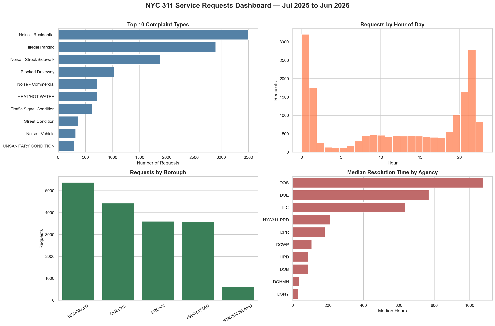

# NYC 311 Service Requests — Data Analytics Project

Analysis of 17,612 New York City 311 service requests (Jul 2025 – Jun 2026), sampled directly from the NYC Open Data API. 311 is the city's non-emergency service line, so the dataset captures what residents complain about, where, when, and how quickly city agencies respond.

This project demonstrates the full analytics workflow: acquiring real (and genuinely messy) data, cleaning it defensibly in Python, exploring it to answer business questions, and communicating findings visually in both Python and Tableau.



**Interactive Tableau dashboard & story:** _add your published Tableau Public link here_

## Tools used

- Python: pandas, matplotlib, seaborn
- Jupyter Notebook for the analysis
- Tableau Public for the interactive dashboard and story
- Git & GitHub for version control

## Repository structure

```
nyc-311-analysis/
├── data/
│   ├── raw/      # original API sample (never modified)
│   └── clean/    # output of the cleaning notebook
├── notebooks/
│   └── 01_data_cleaning_eda.ipynb
├── plots/        # exported charts
├── .gitignore
└── README.md
```

## Data quality findings

Profiling the raw data before touching it surfaced several issues. Each one is worth stating explicitly because catching them is the core of the analyst's job.

- **Dates stored as text** — `created_date` and `closed_date` arrived as strings, blocking any duration or time-based analysis until converted.
- **ZIP codes stored as floats** (e.g. `10012.0`), which is wrong — a ZIP is an identifier, not a number, and floats drop leading zeros.
- **Disguised missing values** — `borough` and `status` used the string `'Unspecified'`, and `descriptor` used `'N/A'`, none of which pandas' `isna()` detects. A systematic audit found 10, 1, and 421 of these respectively.
- **Informative missingness** — 452 blank `closed_date` values are not errors; they're complaints still open. These rows were kept, using an `is_closed` flag rather than dropping them, to avoid biasing the data toward quickly-resolved cases.
- **Daylight-saving anomaly** — a cluster of "closed before created" rows all fell in the 1–2 AM hour on Nov 2, 2025, when clocks fell back and that hour repeated. Their resolution times were voided (set to `NaN`) while the rows were retained.
- **Extreme right skew** — median resolution time was ~1.9 hours versus a mean of ~103 hours, so the **median**, not the mean, is reported throughout.

## Key findings

- **Noise dominates.** Combined, the three noise categories outnumber the runner-up, illegal parking, by more than two to one.
- **Two peaks a day.** Complaints spike at 9 PM (real behavior — parties, loud music). A second, taller spike at midnight is likely a data artifact — timestamps with no real time defaulting to `00:00:00`, not evidence of actual complaint behavior.
- **Volume tracks population, not necessarily "trouble."** Brooklyn leads in raw complaint count, but it's also the most populous borough — a fair comparison needs complaints per capita, not raw totals.
- **Resolution speed varies enormously by agency.** Sanitation and Health close most requests within hours; agencies like OOS, DOE, and TLC take weeks to months — plausibly reflecting the nature of the work rather than simple underperformance.

## Reproducing this analysis

```bash
pip install pandas matplotlib seaborn jupyter
jupyter notebook notebooks/01_data_cleaning_eda.ipynb
```

Run the notebook top to bottom; cleaned data writes to `data/clean/`, and charts save to `plots/`.
